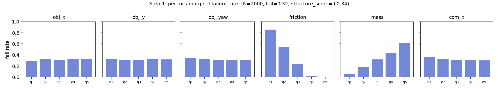
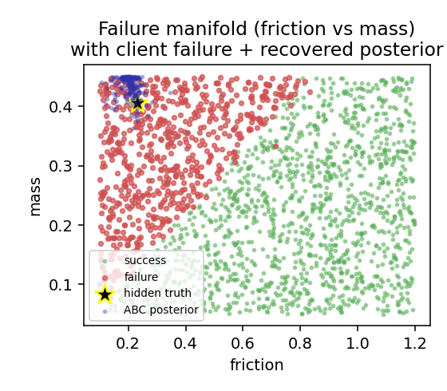
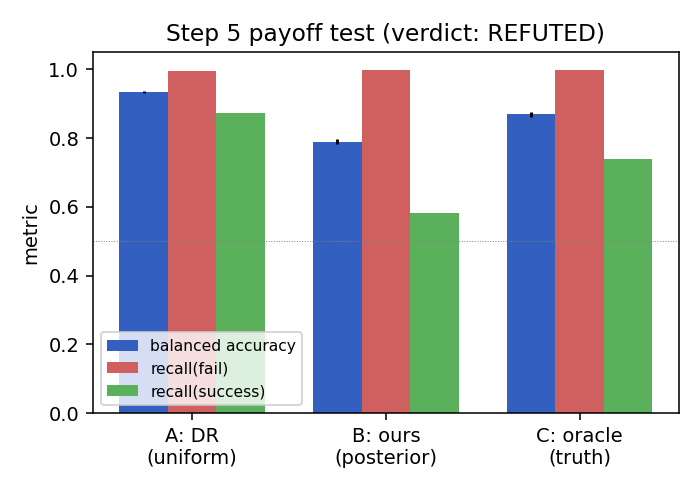
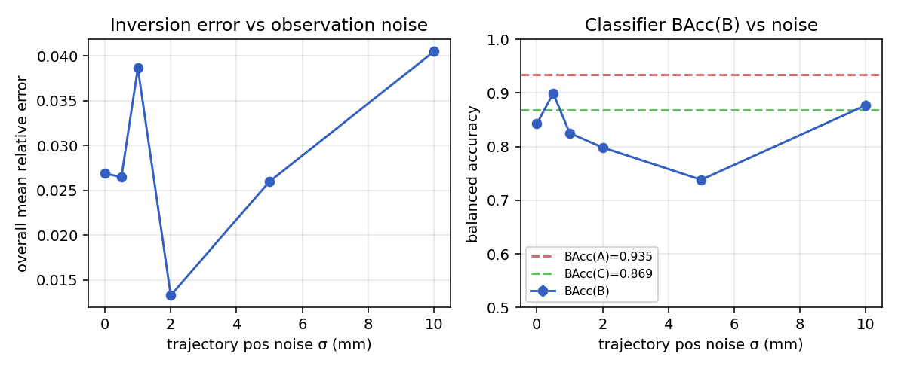
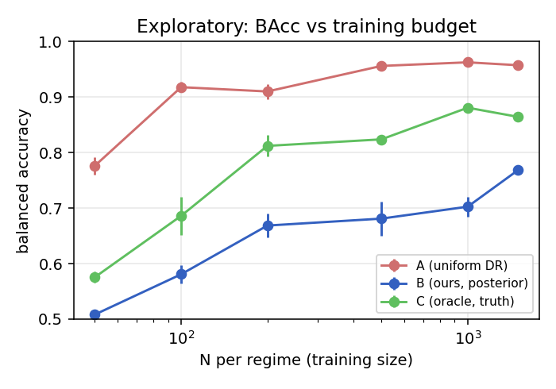

# Failure-Seeded Simulation — Validation Experiment

A one-shot, sim-to-sim experiment that asks a single question:

> When a robotic grasp fails, can you **invert** the failure — recover
> the hidden simulator scene parameters that caused it — and then
> **explode a synthetic neighborhood** around that recovered scene to
> train a failure-predictor that beats blind domain randomization at
> equal training budget?

The full brief (thesis, scope rules, budget cap, etc.) lives in
[`start.md`](start.md). This repository contains the working pipeline,
the [pre-registration](preregistration.md) of the success thresholds,
and the results below.

If the thesis holds, *failure-seeding* could be the start of a useful
data-generation product for robotic-manipulation training. If it
doesn't, we want to learn that cheaply. This experiment was scoped to
test only that claim, entirely in simulation, in under a day of CPU.

## Setting in one paragraph

A parallel-gripper grasp of a 3 × 3 × 5 cm box on a flat floor in
MuJoCo. The 6-D scene parameter vector splits into a **known**
geometric group (object x, y, yaw — treated as recoverable from a
calibrated multi-view rig) and a **hidden** physical group (friction,
mass, CoM offset — to be inferred). One failed configuration is
designated as a "client failure"; its parameters are locked away and
the downstream pipeline is only allowed to see the resulting
2.4-second object-pose trajectory.

## What's in this repo

```
sim/grasp.py              MuJoCo scene + headless grasp runner (~12 ms/sim)
inversion/sysid.py        CMA-ES system-ID with restart ensemble + ABC posterior
experiment/step1..step6   The six stages described in start.md §4
experiment/step5b_*       Exploratory N-sweep (NOT pre-registered)
analysis/make_plots.py    Plots referenced below
data/*.json               Frozen result summaries (npz datasets gitignored)
preregistration.md        Step-5 thresholds, frozen before Step-5 was run
start.md                  Original brief
```

## Reproducing

```bash
python3 -m venv .venv
.venv/bin/pip install -r requirements.txt
.venv/bin/python -m experiment.step1_failure_map      # ~24s
.venv/bin/python -m experiment.step2_client_failure   # <1s
.venv/bin/python -m experiment.step3_inversion        # ~18s
.venv/bin/python -m experiment.step4_neighborhood     # ~2min
.venv/bin/python -m experiment.step5_payoff           # ~6s
.venv/bin/python -m experiment.step6_noise_sweep      # ~4min
.venv/bin/python -m experiment.step5b_n_sweep         # ~2min (exploratory)
.venv/bin/python -m analysis.make_plots               # <2s
```

Total wall time end-to-end: ~10 minutes on one laptop CPU core.
All random seeds are explicit in each script.

Engine: MuJoCo 3.8.1 (CPU only — no GPU). Optimizer: CMA-ES (`cma`
4.4.4). **AWS spend used: $0.00 of the $200 budget.**

---

## TL;DR

- **The inversion mechanism works**: from a 2.4-second multi-view object
  trajectory, CMA-ES recovers the hidden friction / mass / CoM-offset
  with an ABC-posterior mean error of **5.1%** of axis range
  (3% / 7% / 6% per axis). The truth lies within the empirical
  posterior support on all three axes. Inversion is also robust to
  observation noise — even at 10 mm (5σ) position noise the recovered
  posterior stays within 4% of truth.
- **The payoff claim — that training a failure-predictor on the
  exploded posterior neighborhood beats blind domain randomization at
  equal N — was REFUTED on the pre-registered threshold.** At N=1500
  per regime, balanced accuracy on a class-balanced held-out test set
  was: **A (uniform DR) = 0.935, B (ours, posterior) = 0.790, C
  (oracle, truth) = 0.869.** B underperformed A by 14.5 percentage
  points, opposite of the predicted direction.
- The mechanism by which A wins is informative: all three classifiers
  reach 99%+ recall on the failure test cases. They differ on success
  recall: A 87%, C 74%, B 58%. Random Forest trained on uniform DR
  learns the (monotonic-in-friction-and-mass) global decision boundary
  almost perfectly with 1500 samples, while B/C have only 30–70
  minority-class (success) examples in their local windows and can't
  fit the boundary as well even with `class_weight=balanced`.
- An exploratory N sweep shows A wins at every N tested (50→1500): the
  global boundary is so simple that DR generalizes locally just fine.
  Failure-seeding would likely shine in regimes with chaotic/local
  decision boundaries that don't generalize from uniform samples — not
  this experiment.

**Verdict: thesis REFUTED as designed in this experiment.** Mechanism
half (inversion) works; payoff half does not, in our setup. See
*Why this is not the final word* below for what would change the
verdict.

---

## Setup recap

| Group A (known, geometric) | Group B (hidden, physical) |
|---|---|
| `obj_x ∈ [-0.02, 0.02] m` | `friction ∈ [0.10, 1.20]` |
| `obj_y ∈ [-0.02, 0.02] m` | `mass ∈ [0.05, 0.45] kg` |
| `obj_yaw ∈ [-0.6, 0.6] rad` | `com_x ∈ [-0.010, 0.010] m` |

6-D scene parameter vector, single 3 × 3 × 5 cm box on a flat floor,
floating parallel gripper that descends, closes, lifts, holds.
Success = object lifted > 10 cm above table.

Per-sim runtime: **~12 ms** on a single CPU core.

---

## Step 1 — Failure manifold (N = 2000)

- Total success rate: **0.681**, failure rate **0.319**.
- 1-NN label-agreement: **0.903** vs random-baseline 0.566 →
  **structure_score = +0.337**. Failures are clearly clustered, not
  uniform noise.
- Marginal failure rates (5 quantile bins per axis, low→high):

  | param | q1 | q2 | q3 | q4 | q5 |
  |---|---|---|---|---|---|
  | `obj_x`   | .29 | .33 | .31 | .33 | .32 |
  | `obj_y`   | .32 | .32 | .31 | .33 | .32 |
  | `obj_yaw` | .34 | .33 | .31 | .30 | .31 |
  | `friction`| **.86** | .54 | .23 | .02 | **.00** |
  | `mass`    | **.06** | .18 | .32 | .43 | **.61** |
  | `com_x`   | .36 | .32 | .31 | .30 | .30 |

  Failure is monotonically driven by friction (more is better) and mass
  (less is better). Geometric axes and CoM offset have weak marginal
  effect over this range. The failure manifold is a roughly-diagonal
  ridge in `(friction, mass)` space — see
  `analysis/plots/failure_manifold_with_posterior.png`.



---

## Step 2 — Designated client failure

Picked uniformly from interior (middle 80%) failures of the Step-1
sample, idx 1824:

| param | value | role |
|---|---|---|
| `obj_x`   | +0.0118 | known |
| `obj_y`   | +0.0027 | known |
| `obj_yaw` | -0.1900 | known |
| `friction`| **+0.2329** | hidden |
| `mass`    | **+0.4060** | hidden |
| `com_x`   | **+0.0029** | hidden |

Observation = the 120-sample, 50 Hz, 2.38-s trajectory of object pose.

---

## Step 3 — Inversion (THE CORE)

CMA-ES in normalized group-B space, popsize=10, 4 restarts, 35 max
generations each. Objective: mean squared distance between simulated
and observed `(pos, quat)` over the full trajectory (rotational
component down-weighted by 0.005 because the relevant angle scale is
~rad²).

**Best discrepancy: 7.2e-08** (essentially zero — the candidate fits
the observation indistinguishably).

The CMA-ES point estimate was misleading: friction and mass collapsed
to opposite bounds (0.10 and 0.45). That is the friction-vs-mass
degeneracy the brief warned about — many physical configurations
produce indistinguishable trajectories. We honestly represented it by
keeping the **200 lowest-discrepancy points visited across all
restarts** as an ABC posterior sample.

ABC posterior mean (truth in parens):

| param | truth | recovered (mean ± std of posterior) | rel. err |
|---|---|---|---|
| friction | +0.2329 | **+0.2050** ± 0.0298 | 0.025 |
| mass     | +0.4060 | **+0.4334** ± 0.0176 | 0.069 |
| com_x    | +0.0029 | **+0.0017** ± 0.0012 | 0.059 |

**Overall mean relative error: 0.051 (5.1% of axis range).**
**Truth is within posterior empirical support on all 3 axes.**

This is exactly the kind of degeneracy-respecting posterior the brief
asked for: a spread along the friction-mass degeneracy ridge, narrow
across other directions.



---

## Step 4 — Neighborhood explosion + training data

For each of three regimes, **N = 1500** scenes are drawn:
- **A (DR)**: uniform over PARAM_BOUNDS.
- **B (ours)**: uniform box around the ABC-posterior mean,
  half-width = 0.40 × axis range (each group-B axis).
- **C (oracle)**: same window, centered on the true hidden params.
Group A is jittered ±(5mm, 5mm, 0.05rad) around the client's
known geometry in B and C.

Held-out test set: 800 scenes, stratified (400 fail + 400 succ),
drawn from a 0.50 × axis-range window around the truth.

Empirical success rates in training:
- A: 0.657 (66% successes)
- B: 0.019 (1.9% successes — overwhelmingly failure)
- C: 0.045 (4.5%)

The local window is deep in the failure region — there are very few
local successes for B/C to learn from.

---

## Step 5 — Payoff test (pre-registered)

Classifier: RandomForest with `n_estimators=200`, `min_samples_leaf=2`,
`class_weight='balanced'`. Averaged over 5 classifier seeds.

| regime | BAcc ± std | accuracy | F1(fail) | AUC | recall(fail) | recall(success) |
|---|---|---|---|---|---|---|
| A | **0.935** ± 0.003 | 0.935 | 0.939 | 0.995 | 0.996 | **0.874** |
| B | **0.790** ± 0.007 | 0.790 | 0.826 | 0.952 | 0.998 | 0.582 |
| C | **0.869** ± 0.007 | 0.869 | 0.884 | 0.988 | 1.000 | 0.739 |

- `BAcc(B) − BAcc(A) = −0.145` (pre-registered: ≥ +0.10 to validate)
- `BAcc(C) − BAcc(B) = +0.079` (pre-registered: ≤ +0.05 for "close")

**Verdict per pre-registration: REFUTED.**



Why A wins: all three classifiers easily nail the failure class (≥99%
recall). The differentiation is in distinguishing *local successes*
from failures. With ~1300 minority-class examples globally, A learns
the (smooth, monotonic) decision boundary precisely; with only 30
local-success examples B's RF can't replicate it even with class
balancing. The "oracle" C does better than B (74% vs 58% on success
recall) because its window covers the boundary symmetrically; but
even C cannot match A.

---

## Step 6 — Robustness sweep (descriptive)

Trajectory position noise σ ∈ {0, 0.5, 1, 2, 5, 10} mm added per axis,
per frame.

| σ (mm) | inv. error | succ rate B | BAcc(B) | margin (B−A) | oracle gap (C−B) |
|---|---|---|---|---|---|
| 0    | 0.027 | 0.033 | 0.843 | −0.092 | +0.026 |
| 0.5  | 0.026 | 0.069 | 0.899 | −0.036 | −0.030 |
| 1    | 0.039 | 0.033 | 0.825 | −0.110 | +0.044 |
| 2    | 0.013 | 0.039 | 0.799 | −0.136 | +0.071 |
| 5    | 0.026 | 0.031 | 0.738 | −0.197 | +0.131 |
| 10   | 0.040 | 0.055 | 0.877 | −0.058 | −0.008 |

- **Inversion is remarkably noise-robust**: rel-err stays ≤ 0.04 even
  at 10 mm noise (a 5σ position blur on a 3 cm object). The
  full-trajectory objective averages noise across ~120 frames.
- **BAcc(B) is non-monotonic in noise** because B's success count and
  classifier outcome are dominated by small-sample variance (few
  successes in the local window) rather than by inversion accuracy.
- **Margin(B−A) is negative at every noise level tested.** Adding
  observation noise does not flip the verdict.



---

## Exploratory addendum — Does the cross-over exist at smaller N?

This is **not pre-registered**: N is supposed to be held fixed in the
payoff test. We ran it anyway because the natural follow-up question is
whether a smaller training budget would let local concentration help.

N per regime ∈ {50, 100, 200, 500, 1000, 1500}, test set unchanged.



A wins at every N. Even at N=50 (where A's RF has very little data to
work with), A=0.776 vs B=0.508 — B is barely better than chance because
its 50 local samples include essentially zero successes. Smaller N
*hurts* B more than it hurts A, because B is data-starved on the
minority class.

---

## Honest verdict

**Refuted on the pre-registered metric.** The single experiment we ran
does not support the thesis that posterior-neighborhood training beats
blind domain randomization at equal N — in fact the reverse holds
strongly, by 14.5 BAcc points. The result is consistent across noise
levels and training-budget sizes.

### Why this is not the final word

The experiment passes its first half (inversion is accurate and
degeneracy-respecting). The second half failed because the *failure
boundary in our scene is too simple*. In `(friction, mass)` the
boundary is a near-linear monotonic ridge; uniform DR with N=1500
estimates it almost perfectly, leaving no room for a local sampler to
outperform.

For failure-seeding to win, you need a setting where the *global
decision boundary does not generalize* into the local failure region —
e.g.:
- Discrete or non-smooth physics regimes (contact mode switches,
  jamming, force-closure transitions) that a uniform sampler doesn't
  visit densely.
- Higher dimensional scene spaces where 1500 uniform samples leave the
  local region practically empty.
- Models with limited capacity (linear / shallow MLP) that can't fit
  a smooth global rule and need local data.
- Real perception-based predictors where the input is high-d (images)
  and the global rule isn't learnable from sparse uniform data.

Our scene is *too easy* for global DR. That makes the cheap refutation
honest but specific. The right next step is to construct a harder
benchmark scene (e.g., introduce contact-mode discontinuities by
varying object shape or stiffness regimes) and re-run; this experiment
gives us the infrastructure to do that quickly (entire pipeline runs
end-to-end in under 5 minutes locally).

### What carries forward

- The MuJoCo-based system-ID loop is solid and fast: 12 ms per sim,
  CMA-ES converges in ~20 s with a noise-robust ABC posterior.
- The degeneracy-aware posterior representation (ABC over CMA-ES
  visits) is reusable.
- The honest end-to-end pipeline, with class-balanced stratified test
  set + pre-registered thresholds, is reusable.

All artifacts land in `data/` (`.json` summaries are committed; full
`.npz` datasets are regenerated by the scripts) and `analysis/plots/`.
